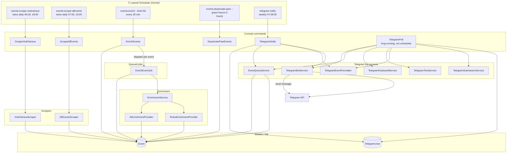

# Events Ostrava – App Architecture

High-level diagram of console commands, scheduled tasks, jobs, and main services.

## Architecture diagram (Mermaid)

## Console commands summary

| Command | Schedule | Description |
|--------|----------|-------------|
| `events:scrape-visitostrava` | Twice daily (06:00, 18:00) | Scrapes VisitOstrava family events, upserts into DB (default 14 days). |
| `events:scrape-allevents` | Twice daily (07:00, 19:00) | Scrapes kids events from AllEvents.in (default 60 days). |
| `events:enrich` | Every 30 min | Finds active events without `short_summary`, dispatches one `EnrichEventJob` per event (default limit 50). |
| `events:deactivate-past` | Hourly | Marks past events as inactive (default grace 2 hours). |
| `telegram:notify` | Weekly Friday 08:00 | Sends weekly digest of weekend events to users with `notify_enabled`. |
| `telegram:poll` | **Not scheduled** | Long-running: polls Telegram API, handles /start, /today, /week, settings, event submission, etc. Run via supervisor or manually. |

## Jobs

| Job | Dispatched by | Purpose |
|-----|----------------|--------|
| `EnrichEventJob` | `events:enrich` command | Queued per event; runs AI/rules enrichment (short_summary, etc.) via `EnrichmentService` and its providers. |

## Data flow (simplified)

1. **Ingest**: Scrapers → `Event` (VisitOstrava, AllEvents).
2. **Enrich**: `events:enrich` → queue `EnrichEventJob` → update `Event` (short_summary, enriched_at, etc.).
3. **Lifecycle**: `events:deactivate-past` → set `is_active = false` for past events.
4. **Telegram**: `telegram:poll` serves users; `telegram:notify` sends weekly digests. Both use `Event` (via `EventQueryService`) and `TelegramUser`.
