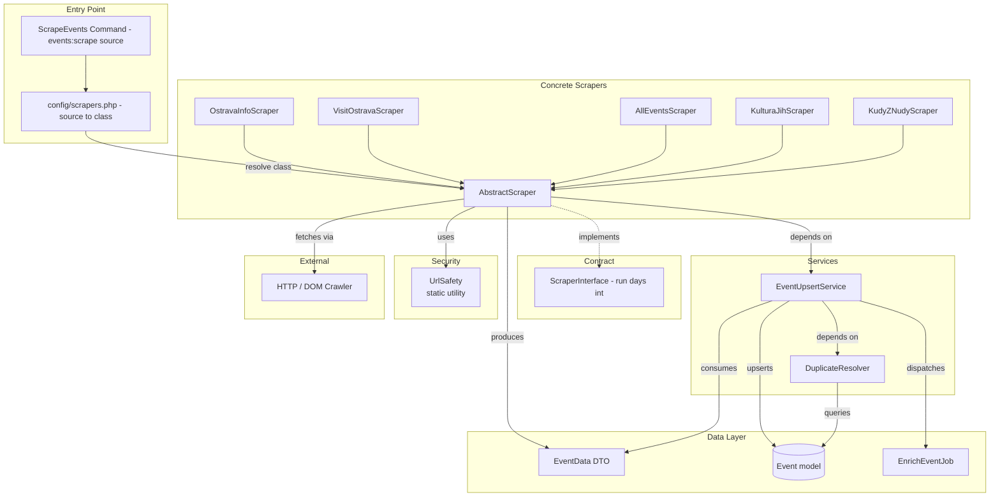
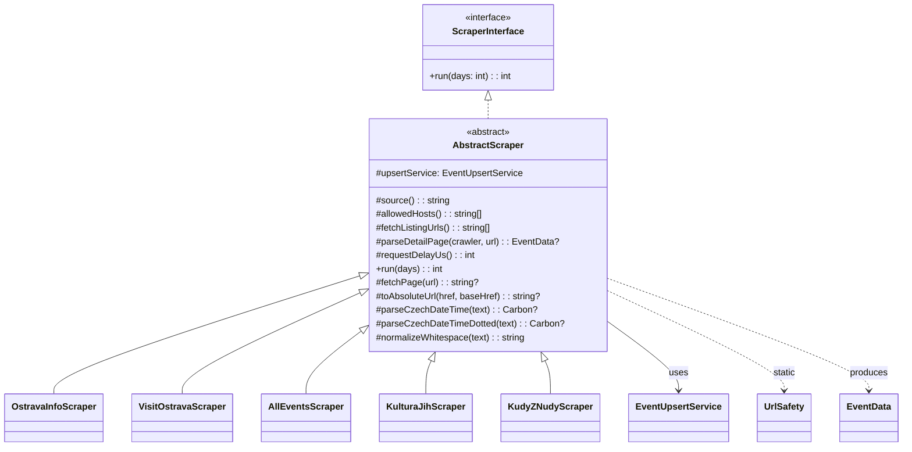
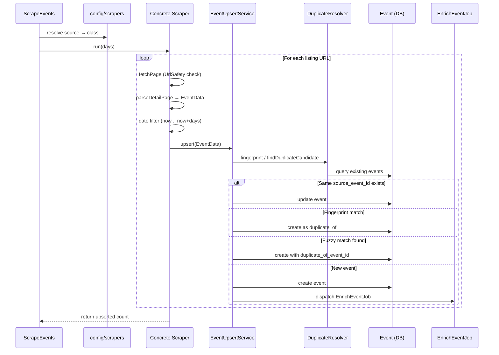

# Scrapers Architecture Schema

## Overview

The scrapers system collects events from multiple external sources, normalizes them into `EventData` DTOs, and upserts them into the database with duplicate detection and optional AI enrichment.

---

## Component Diagram



---

## Class Hierarchy



---

## Data Flow



---

## Source Configuration

| Source        | Class                 | Default Days | Priority | Schedule              |
|---------------|-----------------------|--------------|----------|-----------------------|
| ostravainfo   | OstravaInfoScraper    | 30           | 1        | Manual (run first)    |
| visitostrava  | VisitOstravaScraper   | 14           | 2        | 06:00, 18:00          |
| allevents     | AllEventsScraper      | 60           | 2        | 07:00, 19:00          |
| kulturajih    | KulturaJihScraper     | 30           | 2        | 08:00, 20:00          |
| kudyznudy     | KudyZNudyScraper      | 30           | 2        | 09:00, 21:00          |

---

## Key Dependencies

| Component        | Depends On                          |
|------------------|-------------------------------------|
| AbstractScraper  | EventUpsertService, UrlSafety       |
| EventUpsertService | DuplicateResolver, Event, EnrichEventJob |
| DuplicateResolver | Event (Eloquent)                   |
| ScrapeEvents     | config/scrapers.php, Laravel container |

---

## File Structure

```
app/
├── Console/Commands/
│   ├── ScrapeEvents.php          # Main entry: events:scrape {source}
│   ├── ScrapeVisitOstrava.php    # Alias → events:scrape visitostrava
│   └── ScrapeAllEvents.php       # Alias → events:scrape allevents
├── DTO/
│   └── EventData.php             # Normalized event payload
├── Services/
│   ├── Scrapers/
│   │   ├── Contracts/
│   │   │   └── ScraperInterface.php
│   │   ├── AbstractScraper.php
│   │   ├── OstravaInfoScraper.php
│   │   ├── VisitOstravaScraper.php
│   │   ├── AllEventsScraper.php
│   │   ├── KulturaJihScraper.php
│   │   ├── KudyZNudyScraper.php
│   │   ├── EventUpsertService.php
│   │   └── DuplicateResolver.php
│   └── Security/
│       └── UrlSafety.php
config/
└── scrapers.php                  # Source → class, days, priority
```
